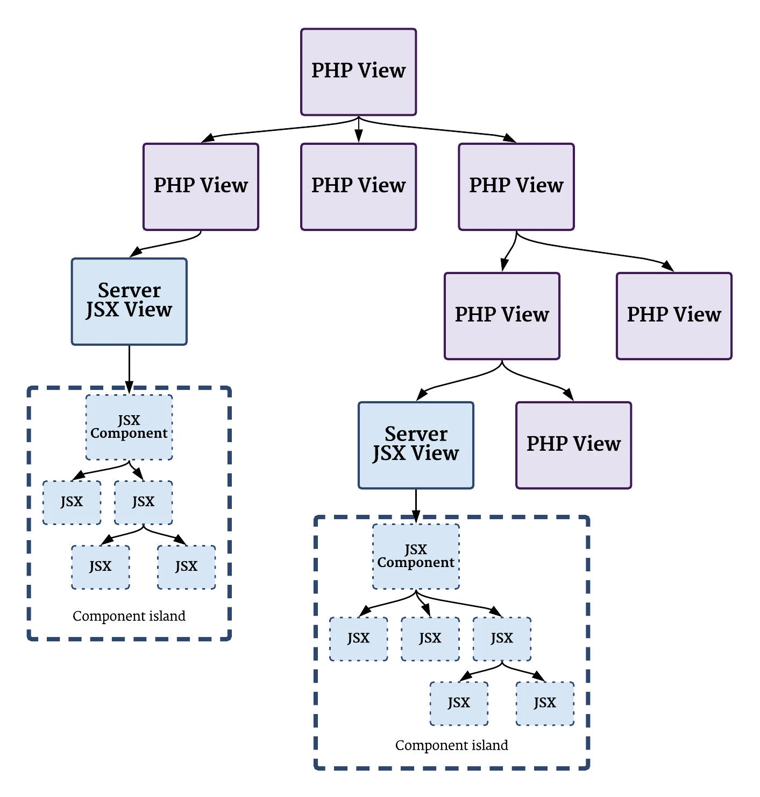

In 2021 I architected and then tech led the implementation of Etsy's server-side rendered Javascript infrastructure. We used [Preact](https://preactjs.com/) and the [islands architecture](https://jasonformat.com/islands-architecture/), which let us create a smooth developer experience without sacrificing our frontend performance.

[I wrote about it in detail on the Etsy Engineering blog Code as Craft.](https://www.etsy.com/codeascraft/mobius-adopting-jsx-while-prioritizing-user-experience)
